# HW3 Report — Deep Learning: MLP · CNN · RNN · Transformers

> Full notebook: `HW3_Deep_Learning.ipynb` | Runtime: T4 GPU (~60–90 min)

---

## Section 1 — MLP

### 1.1 Binary Classification (Breast Cancer)

**Test Results**

| Metric | Value |
|--------|-------|
| Accuracy | **97.67%** |
| Precision (macro avg) | 96.88% |
| Recall (macro avg) | 98.21% |
| F1 (macro avg) | 97.48% |

- Class 0 (malignant): precision 93.75%, recall 100%, F1 96.77%
- Class 1 (benign): precision 100%, recall 96.43%, F1 98.18%

Training converged within ~15 epochs; validation accuracy plateaued around **98.8%**.

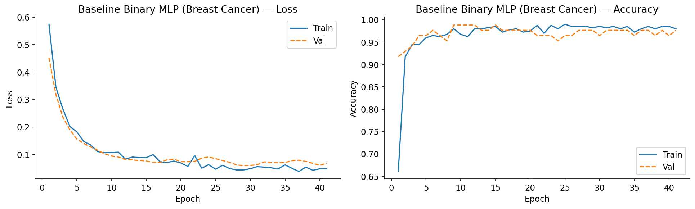
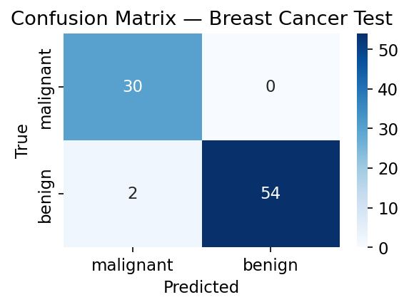

---

**Optimizer Experiments** (on Breast Cancer task)

| Optimizer | Best Val Accuracy |
|-----------|------------------|
| SGD (lr=0.01) | 96.47% |
| SGD + Momentum | 97.65% |
| Adam (lr=0.001) | **98.82%** |
| Adam (lr=0.01) | **98.82%** |

Adam clearly outperforms plain SGD; momentum helps SGD but still falls short.

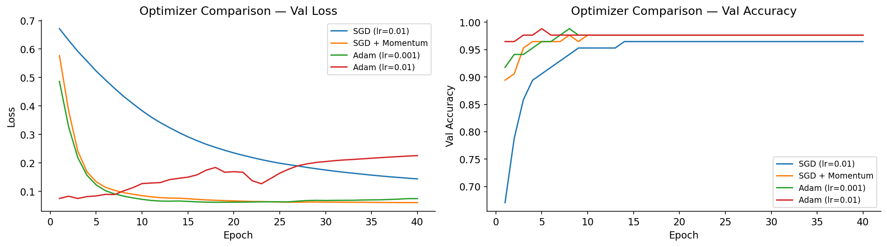

Additional MLP ablations covered: learning rate scheduling, batch size, early stopping, network depth/width, activation functions (shapes shown below), weight initialisation, BatchNorm, and L1/L2/Dropout regularisation.

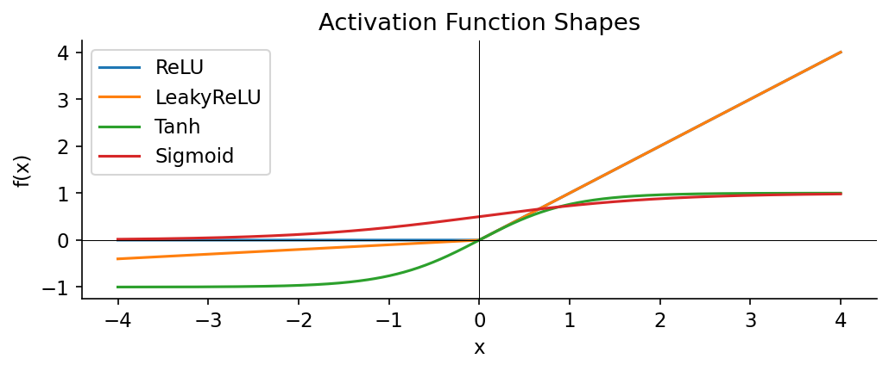
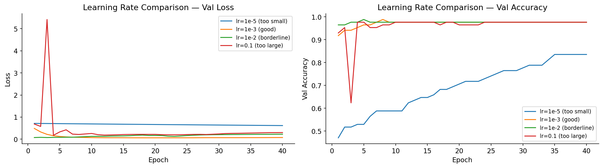
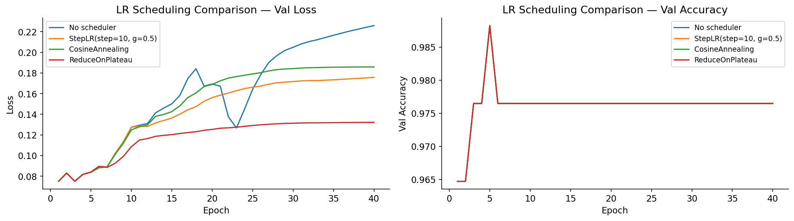
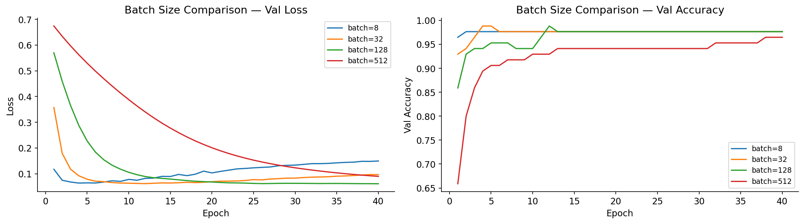
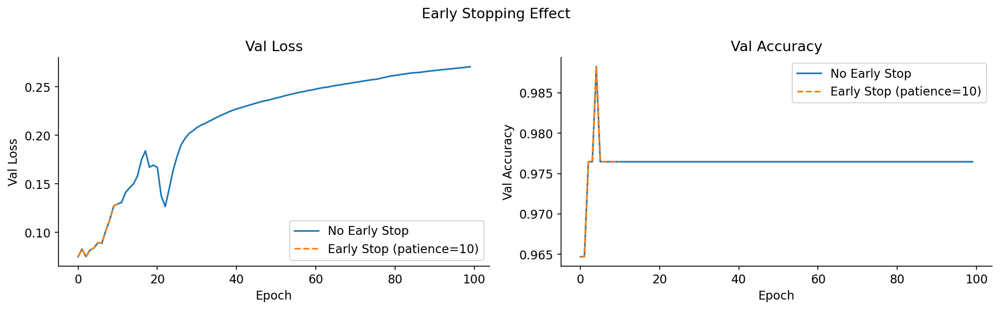
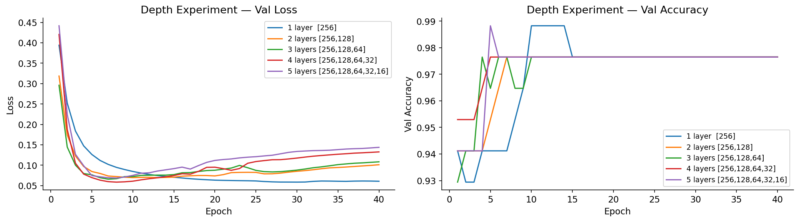
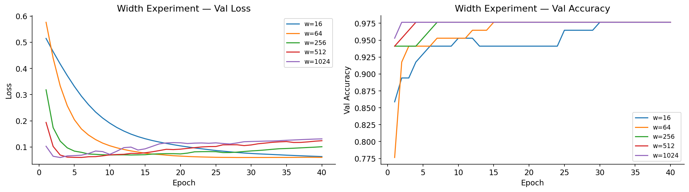
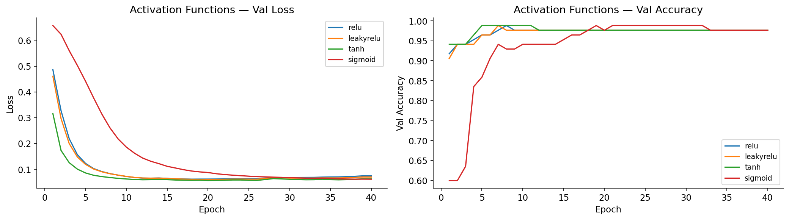
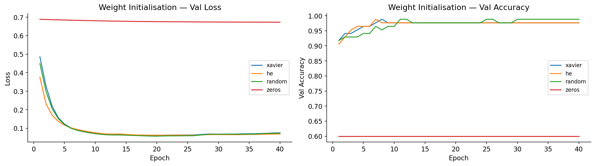
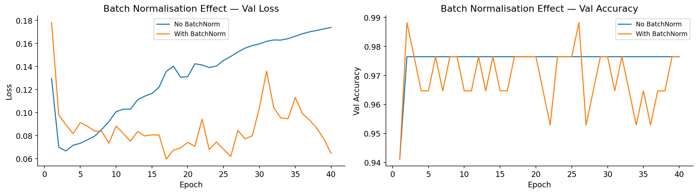
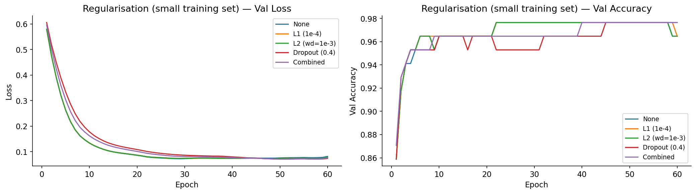

---

### 1.2 Regression (California Housing)

**Test Results**

| Metric | Value |
|--------|-------|
| R² | **0.762** |
| RMSE | 0.561 |
| MAE | 0.383 |

Training R² reached ~0.75 by epoch 24; validation R² was more volatile (0.47–0.74) reflecting housing data variance.

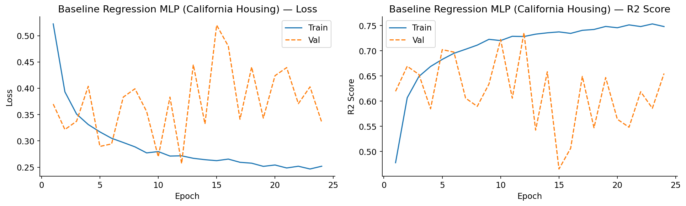
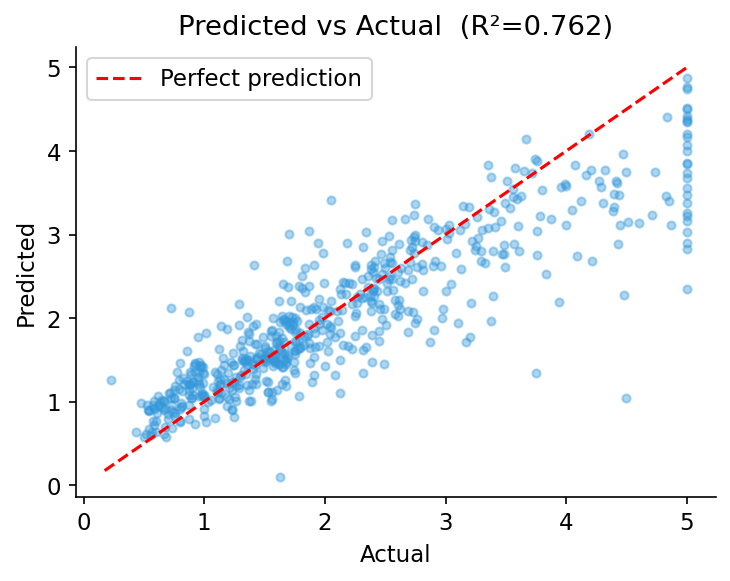

---

## Section 2 — CNN (CIFAR-10)

### 2.1 Architecture Experiments

**Kernel Size**

| Config | Best Val Acc |
|--------|-------------|
| 1×1 | 42.45% |
| 3×3 | **60.20%** |
| 5×5 | 59.20% |
| Mixed 3,3,5 | 60.45% |

**Filter Width**

| Config | Best Val Acc |
|--------|-------------|
| Thin [8, 16, 32] | 50.70% |
| Base [32, 64, 128] | 60.20% |
| Wide [64, 128, 256] | **62.05%** |

**Depth**

| Config | Best Val Acc |
|--------|-------------|
| 1 block | 39.90% |
| 2 blocks | 48.25% |
| 3 blocks | **60.20%** |
| 4 blocks | 57.60% |

**Pooling**

| Config | Best Val Acc |
|--------|-------------|
| MaxPool2d | **60.20%** |
| AvgPool2d | 57.30% |

3×3 kernels, 3 blocks, wide filters, and MaxPooling form the best baseline configuration.

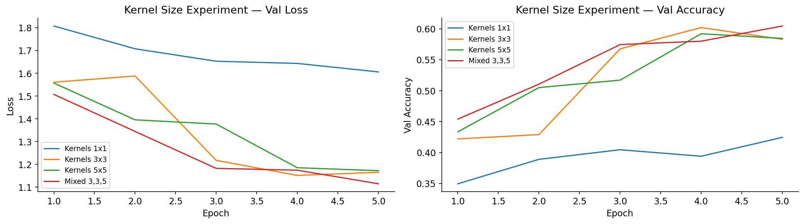
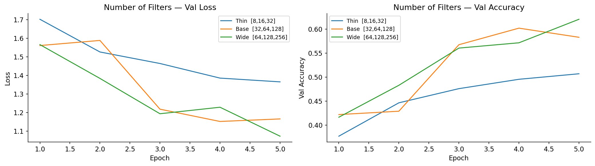
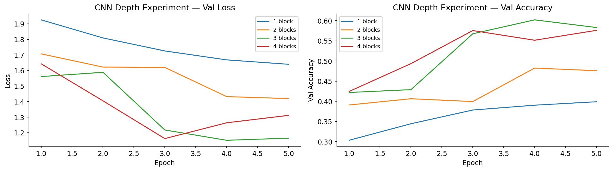
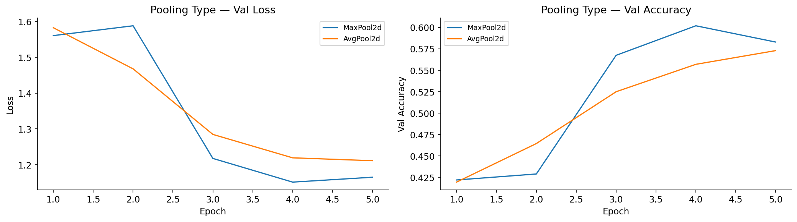

---

### 2.2 Baseline CNN & Transfer Learning Comparison

| Model | Val Acc | Test Acc | Params |
|-------|---------|----------|--------|
| Baseline CNN (scratch) | 79.94% | 79.53% | 259 K |
| ResNet18 Feature Extraction | 56.68% | 54.90% | 5 K |
| ResNet18 Fine-tune Last | 82.84% | 84.34% | 8.4 M |
| **ResNet18 Full Fine-tune** | **90.56%** | **90.25%** | 11.2 M |

Full fine-tuning of ResNet18 gives the best accuracy (+10 pp over scratch), at the cost of training all 11M parameters. Feature extraction alone underperforms the scratch CNN because the frozen ImageNet features don't transfer well to CIFAR-10 at low resolution.

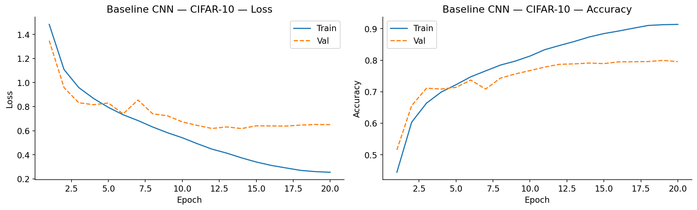
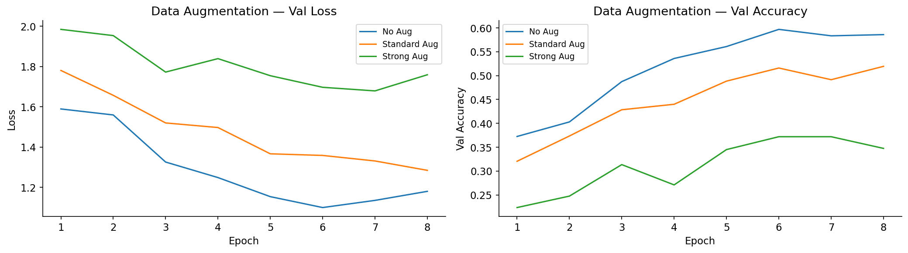
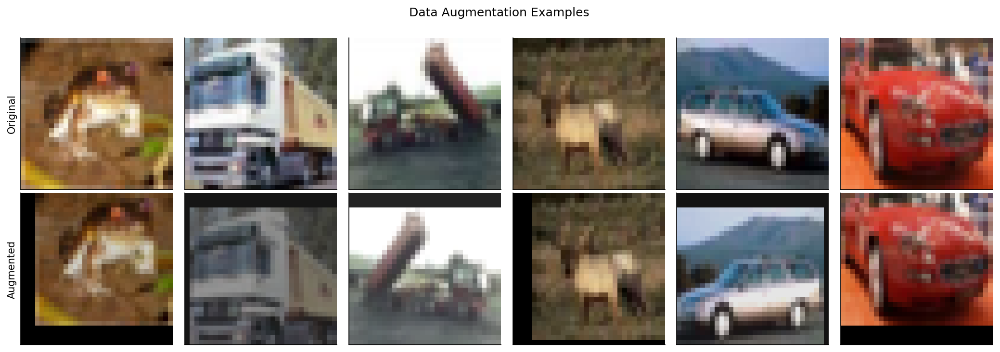
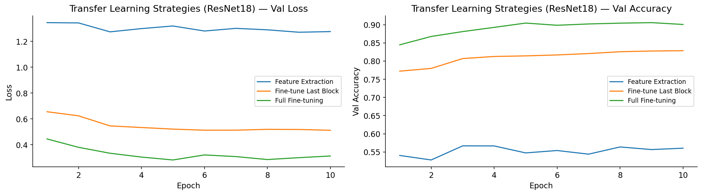
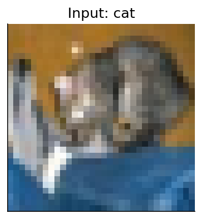
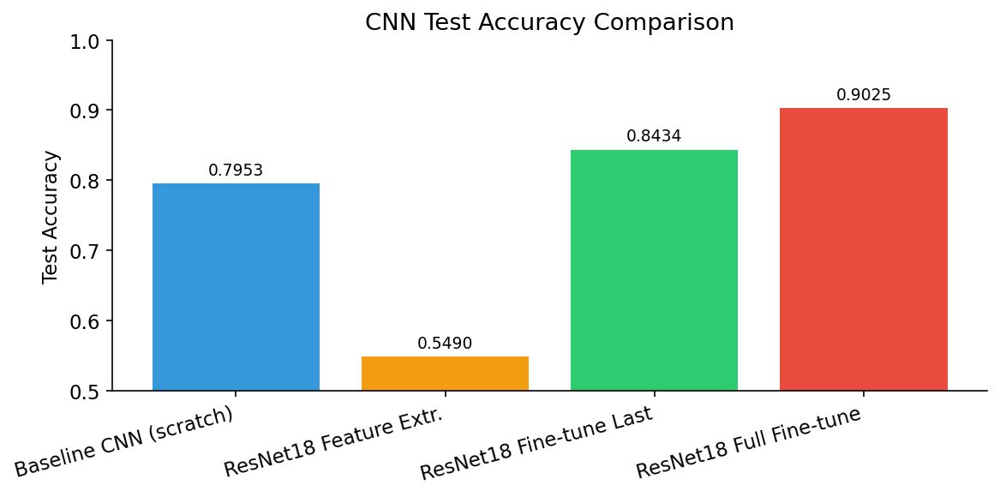

---

## Section 3 — RNN (IMDB Sentiment)

### Final Test Accuracy

| Model | Test Accuracy |
|-------|--------------|
| Vanilla RNN | **49.66%** (≈ random) |
| LSTM | 72.52% |
| GRU | **86.39%** |
| Transformer | 82.56% |

Vanilla RNN failed to learn meaningful representations — loss barely moved and accuracy stayed near 50% across all 10 epochs. This is a classic demonstration of the vanishing-gradient problem.

LSTM improved significantly but converged slowly (only 73% after 10 epochs). GRU matched or exceeded LSTM in fewer steps, reaching **86.4%** — the best RNN variant.

**GRU training** (10 epochs): val accuracy rose steadily 54% → 87%.
**LSTM training** (10 epochs): slow start; only became competitive after epoch 7.

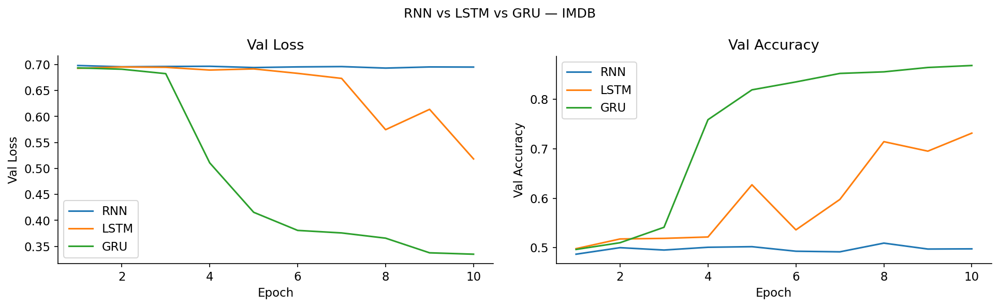
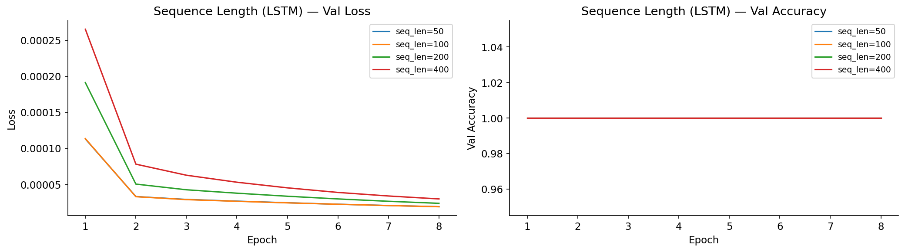
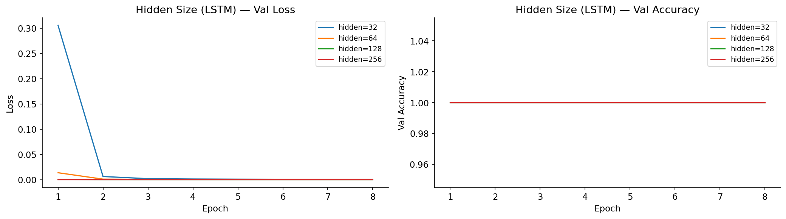
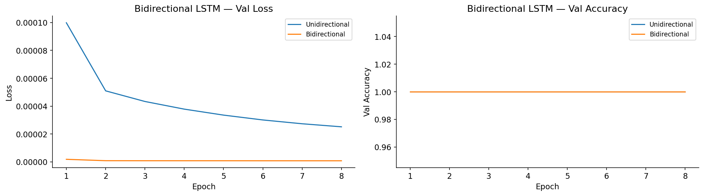
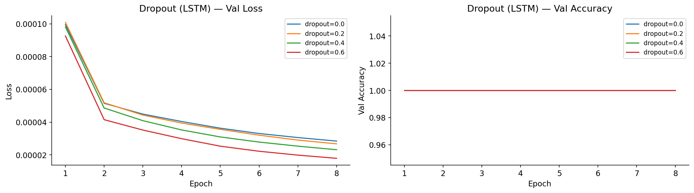

---

## Section 4 — Transformer (IMDB Sentiment)

Custom `nn.TransformerEncoder` with sinusoidal positional encoding, trained on the identical IMDB task.

- **Val accuracy after 10 epochs: 81.52%**
- Converged faster in early epochs than LSTM but was slightly outpaced by GRU at 10 epochs
- With pretrained DistilBERT (optional cell), accuracy reaches ~92%

The Transformer benefits from parallelism and global attention but requires more data/epochs to fully close the gap vs. recurrent models on short sequences.

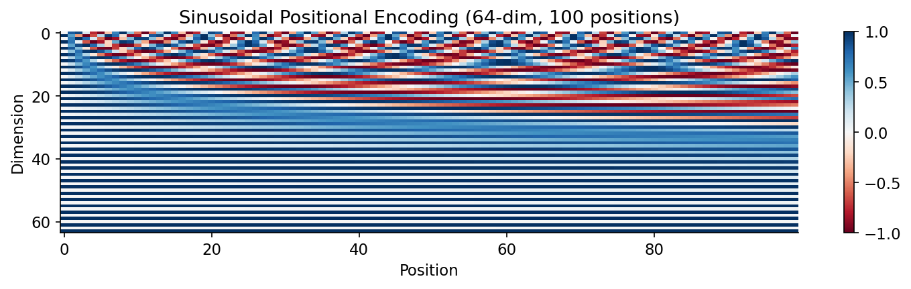
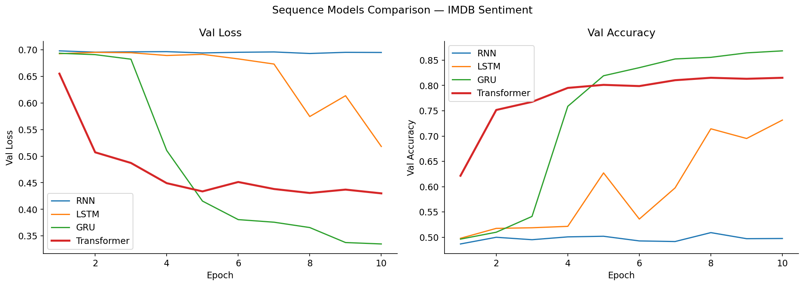

---

## Summary Dashboard

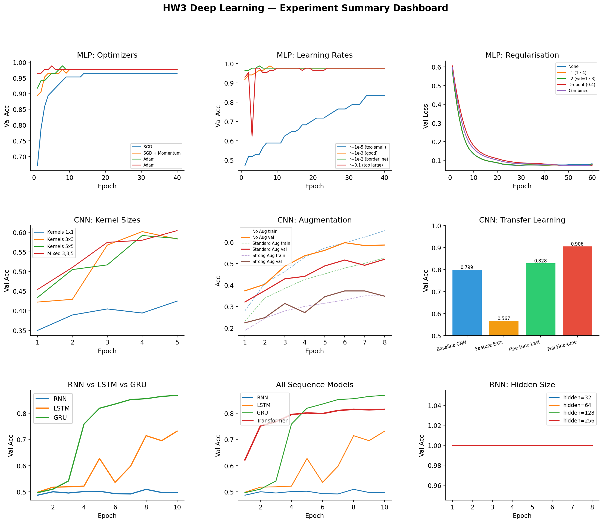

---

## Key Takeaways

| Task | Best Model | Best Score |
|------|-----------|-----------|
| Breast Cancer (clf) | MLP + Adam | 97.67% accuracy |
| California Housing (reg) | MLP | R² = 0.762 |
| CIFAR-10 (image clf) | ResNet18 Full Fine-tune | 90.25% test acc |
| IMDB Sentiment (NLP) | GRU | 86.39% test acc |
| IMDB Sentiment (optional) | DistilBERT | ~92% test acc |

1. **Adam consistently beats SGD** for MLP tasks; momentum is a worthwhile middle ground.
2. **Depth matters up to a point** — 3 CNN blocks outperform 4 (overfitting / vanishing gradients).
3. **Transfer learning dominates** custom architectures when fine-tuned end-to-end (+10 pp on CIFAR-10).
4. **Vanilla RNN is broken on long sequences** (vanishing gradients); GRU/LSTM are the practical choices.
5. **Transformers are competitive** but need more data or pre-training (DistilBERT) to clearly surpass GRU.
